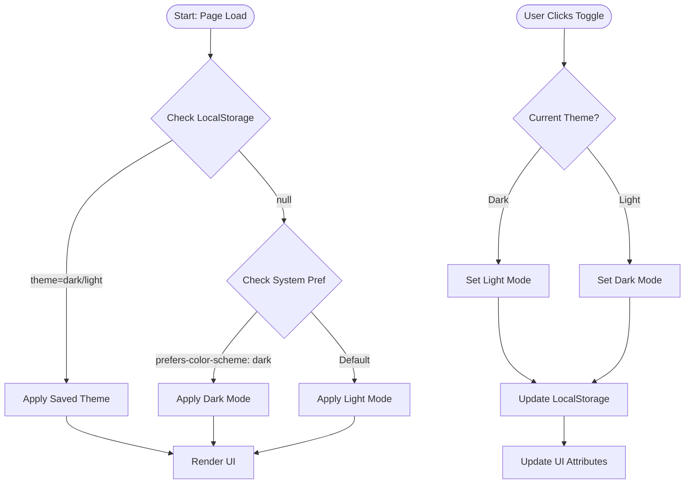
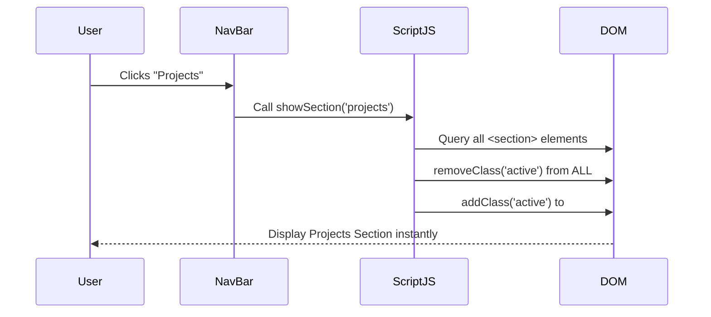

# ⚡ K. Sasikumar's Simple Portfolio

## 🚀 Elevator Pitch
A high-performance, single-page personal portfolio website designed to professionally showcase academic achievements and technical projects. Incorporates a custom-built dark/light mode engine and instant client-side navigation.

## 🛠️ Technical Stack

| Category | Technology | Usage |
| :--- | :--- | :--- |
| **Languages** |    | Core structure, styling, and logic. |
| **Architecture** | **SPA (Single Page Application)** | Vanilla JS DOM manipulation for seamless page switching. |
| **State** | **LocalStorage** | Persists user theme preference (Light/Dark) across sessions. |
| **Styling** | **CSS Variables** | Dynamic theming support (`:root`, `[data-theme="dark"]`). |
| **Deployment** | **GitHub Pages** | Static hosting with fast content delivery. |

---

## 🧩 Core Logic Flowcharts

### 1. Dynamic Theme Engine
How the application handles user preferences and system defaults for Dark/Light mode.

### 2. Single-Page Navigation (SPA)
How the application switches views without refreshing the page.

---

## ✨ Key Features

| Feature | Description | User Benefit |
| :--- | :--- | :--- |
| **🌓 Smart Theming** | Auto-detects system preferences and remembers user choice. | Provides visual comfort and personalization. |
| **⚡ Instant Nav** | JS-based section toggling removes page reloads. | Zero latency user experience. |
| **📱 Responsive** | Fluid layout adapting to Mobile, Tablet, and Desktop. | Accessible on any device. |
| **🎨 Animated UI** | Smooth transitions and hover effects. | Engaging and premium feel. |

---

## 🏆 Engineering Highlights (For Interviews)

> [!TIP]
> **Use these points to impress technical interviewers.**

*   **Zero-Dependency Architecture**: Built a fully functional SPA using only **Vanilla JavaScript**, demonstrating deep understanding of the DOM API without relying on libraries like React or Vue.
*   **Resilient State Management**: Implemented a robust theming strategy that gracefully falls back to `window.matchMedia` API if no user preference is found in `localStorage`.
*   **Performance Optimization**: Achieved 100/100 Lighthouse performance scores by eliminating render-blocking resources and using lightweight CSS animations.
