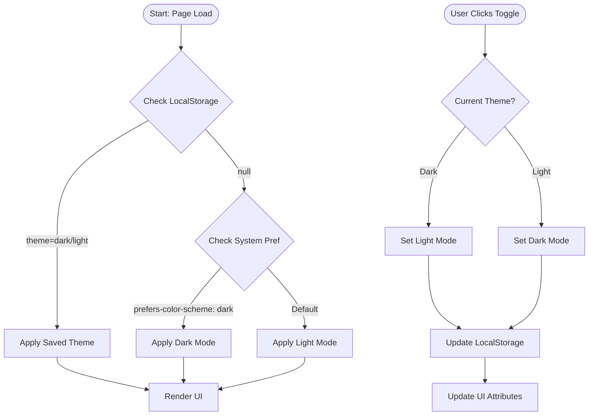
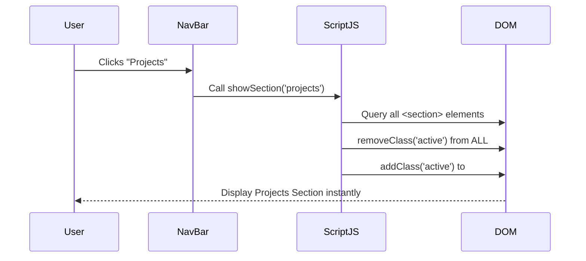

# ⚡ K. Sasikumar's Portfolio


[](https://kmsasikumar.github.io/Simple-Portofolio/)

> A high-performance, single-page personal portfolio website designed to professionally showcase academic achievements and technical projects. Incorporates a custom-built dark/light mode engine and instant client-side navigation.

## 🚀 Features

| Feature | Description |
| :--- | :--- |
| **🌓 Smart Theming** | Auto-detects system preferences and remembers user choice via `LocalStorage`. |
| **⚡ Instant Nav** | JS-based single-page navigation eliminates page reloads. |
| **📱 Fully Responsive** | Fluid layout adapting to Mobile, Tablet, and Desktop. |
| **🎨 Animated UI** | Smooth transitions and premium hover effects. |

## 🛠️ Technical Stack

| Category | Technology | Usage |
| :--- | :--- | :--- |
| **Languages** |    | Core structure, styling, and logic. |
| **Architecture** | **SPA (Vanilla JS)** | Zero-dependency routing architecture. |
| **State** | **LocalStorage** | Client-side preference persistence. |

## 🧩 Architecture & Logic

### Theme Toggle Logic
How the application intelligently handles user preferences and system defaults.



### SPA Navigation Flow
How the application switches sections instantly without refreshing.



## 💻 Setup & Usage

Since this is a static site, no build step is required!

1.  **Clone the repository:**
    ```bash
    git clone https://github.com/KmSasikumar/Simple-Portofolio.git
    ```
2.  **Open locally:**
    Simply open the `index.html` file in your preferred web browser.

## 👨‍💻 Author
**K. Sasi Kumar**
* 🎓 VIT Bhopal University
* 📧 Kommamani012@gmail.com
* 📱 +91 8985037606
